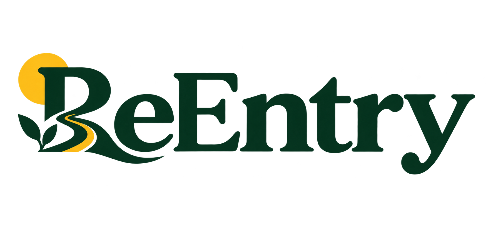
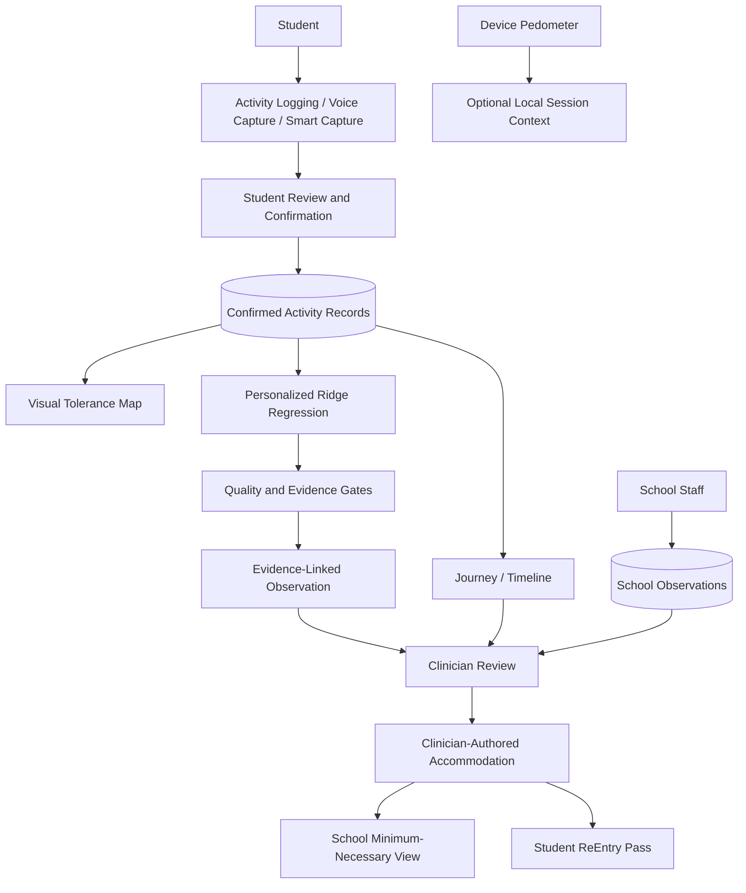

<p align="center">
  
</p>

# ReEntry

### Return to school. Return to friends. Return to life.

A concussion can interrupt much more than sports.

For a teenager, recovery can mean trying to make it through chemistry under bright lights, reading long enough to finish an assignment, concentrating in a noisy classroom, using a laptop for schoolwork, or simply spending time with friends without needing to step away.

Most of those moments happen between appointments.

By the time a student sees their clinician again, it can be difficult to remember exactly what happened: Which activities felt manageable? When did they need a break? Was there something about the environment that made an activity harder? What support actually helped?

**ReEntry was built for that gap.**

ReEntry helps adolescents capture how returning to school and everyday life is actually going. It turns student-confirmed experiences into understandable longitudinal evidence, helps clinicians inspect supported patterns, and gives schools only the information they need to support the student.

The goal is not to tell a teenager when they are "recovered."

The goal is to make the experience between appointments easier to capture, understand, and communicate.

> **Student experiences school → ReEntry captures the experience → student confirms it → patterns become visible → Clinician reviews the evidence → Clinician records an accommodation → School Staff receive the support information they need → student carries the ReEntry Pass**

---

## Recovery Happens in Real Life

Concussion recovery does not happen only in a clinic.

It happens while a student is trying to return to:

- classes;
- reading and assignments;
- screens and school devices;
- noisy or busy environments;
- concentration-heavy work;
- physical activity;
- social activity; and
- a normal school day.

A student may remember that Tuesday was difficult without remembering what they were doing, how long they had been doing it, or what helped.

A clinician may see the student days or weeks later and have to reconstruct those experiences retrospectively.

A school may want to help but should not need access to the student's entire private recovery record to do so.

ReEntry connects those pieces.

It is not a generic symptom tracker, diary, or mood journal. Its focus is **functional tolerance during adolescent return to school and everyday life**.

---

## What ReEntry Does

### Capture a School Day Without Turning It Into Homework

Students can quickly record:

- what they were doing;
- how long they did it;
- whether it felt **Manageable**, **Some difficulty**, or **Very difficult**;
- relevant challenge or context tags; and
- an optional note.

These are student-reported functional experiences, not medical conclusions.

### AI-Assisted Voice Capture

When typing feels like too much friction, a student can describe an activity naturally.

> Student speaks → speech recognition → deterministic parser → structured draft → student reviews or edits → **Confirm & Log**

ReEntry can extract supported details such as activity, duration, manageability, challenge tags, and explicitly dictated note content.

The student always reviews the result before it becomes part of their record.

ReEntry does not automatically save a transcript, retain raw audio, or use speech to make medical conclusions. Typed capture follows the same structured parsing path.

### School Schedule and Smart Capture

Students can maintain their recurring school schedule.

After a scheduled class ends, ReEntry can offer a timely opportunity to record how the activity went while the experience is still fresh.

Known schedule information such as class, category, timing, and duration can be prefilled. The student still supplies or confirms the functional experience before anything is saved.

> **We automate the collection opportunity, not the medical interpretation.**

### Local Class Reminders

Students can optionally enable device-local reminders after selected classes.

The reminders are designed to reduce the burden of trying to reconstruct an entire school day later.

Notification permission is requested only when reminders are enabled, and the reminders do not create server-side monitoring of the student.

---

## Optional Device Activity Context

ReEntry also explores a deliberately limited form of phone/device context.

On supported native devices, the app can display optional step context using `expo-sensors` / `Pedometer`.

This feature is intentionally conservative:

- the student chooses whether to allow access;
- no location is collected;
- no hidden or continuous background monitoring is performed;
- step history is not persisted;
- steps are not attached to activity records;
- steps are not shared with School Staff;
- steps are not shared with Clinicians;
- steps are not an input to the ML model; and
- steps are never interpreted as concussion severity, readiness, or medical safety.

Unsupported devices and web receive a graceful unavailable state.

ReEntry does **not** claim to provide screen-time surveillance, location tracking, heart-rate monitoring, continuous Android step history, or sensor-based concussion detection.

> **Context can support a conversation without becoming a medical conclusion.**

---

## Seeing the Week, Not Just Individual Entries

### Observation Window

ReEntry makes the evidence under review explicit.

Today and Journey show the student's actual loaded observation window using:

- first recorded date;
- most recent recorded date;
- represented days; and
- activity count.

The observation window describes the available evidence. It does not imply that any number of days represents a universal concussion recovery timeline.

### Visual Tolerance Map

Individual activity logs can become difficult to understand as a list.

The Tolerance Map organizes recent functional experiences across:

- Class / School
- Screens
- Reading
- Noise / Busy
- Concentration
- Physical Activity
- Social Activity

Each cell represents actual supporting records and uses four descriptive states:

- **Manageable**
- **Some difficulty**
- **Very difficult**
- **No record**

Students can select a cell or functional area to inspect the evidence underneath it.

No synthetic evidence is generated.

The map is descriptive. It is **not a recovery percentage, severity score, readiness score, or medical clearance system**.

---

## Journey: From Individual Moments to Patterns

A student should not have to mentally compare dozens of entries to understand what has been happening.

Journey combines:

- the observation window;
- chronological activity history;
- personalized evidence-linked observations; and
- supporting-record drill-down.

This is where ReEntry's personalized ML model becomes useful.

Instead of asking:

> "What does the model think my recovery percentage is?"

ReEntry asks:

> **"Are there sufficiently supported patterns in this student's own confirmed functional experiences that may be useful to review?"**

Every surfaced pattern can be traced back to supporting records.

---

## Personalized ML Pattern Engine

ReEntry implements a personalized ridge-regression pattern engine in TypeScript.

The model operates on the **current student's own confirmed records**.

Its pipeline:

1. sorts confirmed activity records chronologically;
2. creates deterministic features from activity categories, challenge tags, normalized duration, relative position in the observation window, and immediately prior recorded manageability;
3. fits a ridge-regularized model;
4. evaluates it using a chronological final 25% holdout with at least three records;
5. compares mean absolute error against a training-mean baseline;
6. applies minimum-record, rating-variability, validation-quality, coefficient-strength, and evidence-support gates;
7. suppresses unsupported or unusable patterns; and
8. surfaces at most three eligible associations with supporting activity IDs.

The current gate requires at least 10 records and useful variation in recorded manageability.

Category, challenge-tag, and duration coefficients can become human-readable observations only when both the feature and direction have sufficient supporting records.

Internal validation metrics remain model metadata rather than unexplained student-facing scores.

### What the Model Does Not Do

The model does **not**:

- diagnose concussion;
- classify concussion severity;
- establish medical causation;
- predict a recovery date;
- calculate a recovery percentage;
- determine medical readiness;
- recommend treatment;
- recommend medication;
- provide return-to-play clearance; or
- prescribe accommodations.

It identifies supported associations in recorded functional experiences.

---

## "Why Am I Seeing This?"

An AI-assisted observation should not be a mysterious statement that the student or clinician is expected to trust.

ReEntry connects surfaced observations back to evidence:

> **Pattern → support information → Why am I seeing this? → supporting records**

Supporting activity IDs allow the student and Clinician to inspect the records behind an observation.

This provides **evidence provenance**, not proof of medical causation.

---

## School Observations

Students experience school from one perspective. School Staff may observe something different.

Actively linked School Staff can therefore record a separate structured observation:

- **Completed as planned**
- **Completed with support**
- **Took a break**
- **Reduced or stopped**

A School Observation can include:

- school context;
- structured supports used;
- an optional neutral note;
- author provenance; and
- date/time provenance.

These records remain explicitly **school-recorded**.

They are not silently merged into student self-report.

They do not alter the student's Tolerance Map, Journey student evidence, or personalized ML training data.

Clinicians can review them as a distinct evidence stream.

---

## The Clinician Makes the Decision

ReEntry's Clinician workspace brings together relevant information for actively linked students:

- student-reported functional evidence;
- longitudinal context;
- personalized evidence-linked observations;
- supporting-record drill-down;
- School Observations; and
- recorded accommodations.

The distinction is intentional:

> **AI surfaces observational evidence. The Clinician interprets it. The Clinician—not AI—records accommodations.**

ReEntry does not automatically generate or prescribe school accommodations.

---

## Giving Schools What They Need — Not Everything

School Staff need actionable support information.

They do not necessarily need a student's entire private recovery history.

The School Staff workspace therefore focuses on:

- current recorded school supports;
- School Observation tools; and
- minimum-necessary information for actively linked students.

Private student activity history, Journey evidence, and other recovery information are not simply exposed to School Staff because they are linked to the student.

That privacy boundary is part of the product design.

---

## ReEntry Pass

When a Clinician records an accommodation, the same support can become useful in several places:

**Clinician → School → Student**

The student's ReEntry Pass provides a simple view of their currently recorded school supports that they can carry or show when needed.

The Pass is **not**:

- medical clearance;
- proof of recovery;
- a readiness score; or
- a return-to-play decision.

It communicates recorded supports.

---

## Need Support

Recovery also involves people.

Need Support gives students explicit ways to reach:

- **School support**
- **Care team**
- **Trusted adult**
- **Emergency help**

A student can manage their own Trusted Adult contact.

Explicitly shared School Staff and Clinician support contacts contain only the support information required for this workflow: display name, role, support phone, and support email.

Active-link and matching-role Row Level Security rules determine which shared support contacts a student can access without exposing broader profile information.

Call, Email, and applicable Text actions always require a student action.

Emergency help is also explicit-action only.

> **ReEntry does not monitor for emergencies or contact anyone automatically.**

ReEntry is not an emergency-response service.

---

## Privacy-Aware Role Design

Different people need different information.

| Role | Access |
| --- | --- |
| **Student** | Own private activity/check-in records, schedule, Tolerance Map, Journey, accommodations, ReEntry Pass, trusted-support configuration, and other student-owned preferences/data |
| **Clinician** | Relevant evidence for actively linked students, School Observations, evidence-linked ML observations, and permitted accommodation workflows |
| **School Staff** | Minimum-necessary recorded school supports and School Observation workflows for actively linked students |

Supabase Auth identifies users.

PostgreSQL Row Level Security combines role checks with active `student_access` relationships.

This means data minimization is enforced at the database boundary rather than relying only on hiding information in the UI.

The `shared_support_contacts` table is intentionally separate from broader/private profile data and contains only explicitly shared support information.

ReEntry does not claim HIPAA compliance, regulatory certification, or production clinical deployment readiness.

---

## Responsible AI by Design

Responsible AI in ReEntry is not a disclaimer added at the end of the project.

It shapes the workflow.

### Voice

**Capture → draft → student review → confirmation → persistence**

The student remains in control of what becomes a record.

### Personalized ML

**Confirmed student records → personalized model → validation/evidence gates → supported observation**

Insufficient evidence produces no pattern rather than a forced conclusion.

### Explainability

**Observation → supporting evidence → exact records**

A user can inspect why something appeared.

### Clinician

AI does not make accommodation decisions.

### School

Schools receive minimum-necessary support information rather than the student's entire private recovery history.

### ReEntry Pass

The Pass communicates recorded supports, not medical readiness.

### Device Context

Optional device activity remains context, not medical interpretation.

### Need Support

Communication requires explicit student action. ReEntry does not automatically contact people or attempt to detect emergencies.

### Language

ReEntry intentionally uses observational language such as:

- "You reported..."
- "Your records show..."
- "This pattern appeared..."
- "Compared with your earlier entries..."

ReEntry avoids outputs that claim diagnosis, severity, recovery percentage, recovery date, treatment recommendations, medication advice, medical readiness, causation, return-to-play clearance, or automatically prescribed accommodations.

---

## Designed for a Teenager Who Is Already Dealing With Enough

A recovery tool should not become another assignment.

ReEntry's adolescent-focused UX includes:

- fast activity logging;
- voice-assisted capture to reduce long-form typing;
- Smart Capture after relevant school activities;
- comfortable touch targets;
- Dark Mode;
- Low-Stimulation Mode;
- restrained motion and interaction feedback;
- visual rather than purely textual longitudinal evidence;
- consistent role-specific navigation; and
- evidence drill-down instead of unexplained AI conclusions.

The visual system uses warm cream, deep forest, and a focused ReEntry yellow accent to create hierarchy without turning every interaction into an alert.

Low-Stimulation Mode is a UX adaptation intended to reduce non-essential visual competition and motion where supported. It is not presented as treatment for concussion symptoms.

No WCAG or formal accessibility certification is claimed.

---

## Technical Architecture

**Frontend**

- Expo
- React Native
- React Native Web
- Expo Router
- TypeScript

**Backend**

- Supabase
- PostgreSQL
- Supabase Auth
- PostgreSQL Row Level Security
- Supabase `sign-up` Edge Function

**Native capabilities**

- `expo-speech-recognition`
- `expo-notifications`
- `expo-sensors` / `Pedometer`

**ML**

- personalized local ridge-regression pattern engine

The project supports web and native mobile development.

Native speech recognition, local notifications, and pedometer behavior require an appropriate native/development build and compatible platform permissions/hardware. Expo Go and web cannot fully represent those native capabilities.

---

## Architecture



School Observations can inform Clinician review but never become inputs to the personalized ML engine.

Device steps remain a separate local context path and are neither persisted nor clinically interpreted.

---

## Data Model

Important PostgreSQL tables include:

- `profiles`
- `user_preferences`
- `activity_logs`
- `challenge_tags`
- `daily_checkins`
- `accommodation_records`
- `student_access`
- `student_schedule_items`
- `school_observations`
- `student_trusted_contacts`
- `shared_support_contacts`

Migrations `00007` and `00008` implement persisted student-managed Trusted Adult contacts and explicitly shared support contacts in the demo environment.

Their presence does not imply production or clinical deployment.

---

## Evidence-Informed Design

ReEntry's design was informed by themes in:

- the **Consensus statement on concussion in sport: the 6th International Conference on Concussion in Sport**;
- the **Living Concussion Guidelines**; and
- the **PedsConcussion Living Guideline for Pediatric Concussion**.

Relevant themes include:

- returning to school;
- gradual return to activity as tolerated;
- temporary school supports;
- ongoing monitoring and modification; and
- collaboration among students, caregivers, school personnel, and healthcare professionals.

Those themes influenced concrete ReEntry decisions including functional activity capture, a longitudinal observation window, recorded accommodations, role-specific collaboration, and human clinical interpretation.

These sources provide design context.

They do **not** represent endorsement of ReEntry, clinical validation of ReEntry, or a claim that ReEntry itself provides medical guidance.

---

## A Day With ReEntry

All people and records in the demo are synthetic.

Meet **Maya**, a 16-year-old student returning to school after a concussion.

Her recovery does not happen on a dashboard. It happens while she is trying to get through her normal day.

1. Maya starts with her recurring school schedule already in ReEntry.
2. After class, Smart Capture gives her a timely opportunity to record how the activity went.
3. If typing feels like too much friction, she can describe the experience using Voice Capture.
4. Maya reviews the structured draft before confirming anything.
5. Her confirmed experiences gradually build her Tolerance Map and Journey.
6. Once enough usable evidence exists, her personalized model may surface an evidence-linked observation.
7. Maya or her Clinician can inspect the records supporting that observation.
8. School Staff can separately record what they observed at school without altering Maya's self-reported evidence.
9. Her Clinician can review those evidence streams together.
10. The Clinician—not the AI—decides whether to record an accommodation.
11. School Staff receive the relevant support without gaining access to Maya's entire private recovery history.
12. Maya can carry those recorded supports through her ReEntry Pass.
13. If she needs a person rather than another screen, Need Support gives her a direct path to her School support, Care team, or Trusted Adult.

Additional synthetic students demonstrate the multi-student School and Clinician workspaces.

No demo passwords are published in this README.

---

## Why ReEntry Is Different

There are many ways to collect symptoms.

ReEntry focuses on a different question:

> **What does returning to everyday life actually look like for this student?**

It connects:

**real-world adolescent experiences  
→ low-friction confirmed capture  
→ schedule/context-aware collection  
→ functional tolerance visualization  
→ personalized evidence-linked ML  
→ structured School Observations  
→ Clinician interpretation  
→ recorded accommodations  
→ minimum-necessary School communication  
→ ReEntry Pass**

The value is not any single screen.

It is the loop between the student experiencing life, the evidence they choose to record, the Clinician trying to understand that evidence, and the School trying to provide appropriate support without seeing everything.

---

## Real-World Feasibility

ReEntry is designed around tools that students and schools could realistically have access to:

- ordinary smartphones;
- student-confirmed observations;
- optional local device context;
- local reminders;
- role-based collaboration; and
- Clinician-authored accommodations.

It does not depend on:

- specialized medical hardware;
- continuous surveillance;
- automatic concussion detection;
- continuous Clinician monitoring; or
- giving School Staff the student's complete private recovery record.

This practical architecture does not imply production or clinical deployment readiness.

---

## How to Run ReEntry

### Prerequisites

- Node.js
- pnpm 11
- a Supabase project configured for ReEntry
- an appropriate native/development build for native-only capabilities

### Environment

Create a local `.env` with the public Supabase client configuration:

```bash
EXPO_PUBLIC_SUPABASE_URL=your-project-url
EXPO_PUBLIC_SUPABASE_ANON_KEY=your-anon-key
```

Never expose a `SUPABASE_SERVICE_ROLE_KEY` to client code or commit it to source control.

### Run on Web

```bash
pnpm install
pnpm web
```

### Native Development

```bash
pnpm start
pnpm android
pnpm ios
```

Speech recognition, notifications, and pedometer/device activity require a compatible native/development build and appropriate platform permissions/hardware.

Do not rely on Expo Go or web to represent those native capabilities fully.

---

## Prototype Status and Limitations

ReEntry is a **Hack for Humanity prototype**.

It is not:

- a clinically validated concussion system;
- a diagnostic tool;
- an approved medical device;
- an emergency-response service; or
- a substitute for professional medical advice.

The personalized ML workflow is demonstrated using prototype and synthetic demo data where applicable.

Step availability depends on native platform, hardware, and permission support.

Before real-world clinical deployment, ReEntry would require substantially more work including clinical evaluation, privacy and security review, accessibility testing, regulatory analysis where applicable, and testing with real students, families, School Staff, and healthcare professionals.

---

## What We're Trying to Build

A concussion can make ordinary parts of being a teenager unexpectedly difficult.

A class. A screen. A crowded lunchroom. Homework. Practice. Friends.

Those experiences should not disappear simply because they happened between appointments.

ReEntry is an attempt to make those moments easier to capture, easier to understand, and easier to communicate — **without asking AI to make the medical decisions that belong to people.**

**Return to school. Return to friends. Return to life.**
