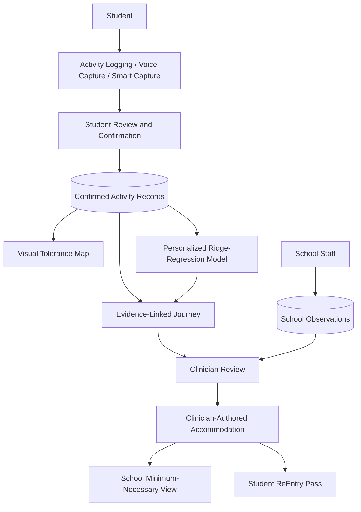

# ReEntry

**Return to school. Return to friends. Return to life.**

ReEntry is an adolescent-first concussion recovery platform focused on return-to-school and return-to-life. It helps students capture real-world functional tolerance, turns confirmed records into evidence-linked observations, and supports privacy-aware collaboration between students, school staff, and clinicians.

ReEntry supports recovery monitoring and communication. It does not diagnose concussion, determine severity, predict recovery, provide medical clearance, or replace professional medical advice.

## The Problem

Concussion recovery happens between clinical visits. Classes, reading, screens, noisy environments, concentration, physical activity, and social activity can feel different from day to day—and those experiences can be difficult to remember and communicate later.

Clinicians need useful longitudinal context. Schools need actionable supports without access to a student's entire private recovery record. ReEntry addresses that communication gap.

## Core Workflow

> Student experiences school → ReEntry captures functional tolerance → personalized ML identifies supported patterns → clinician reviews supporting evidence → clinician records an accommodation → school sees the minimum-necessary support → student carries the ReEntry Pass

School staff can also contribute structured functional observations. These remain a separate, provenance-labeled evidence source; they are not silently mixed into student-reported activity or the personalized ML model.

## Key Features

### Today

Fast activity logging captures the activity, duration, self-reported manageability, challenge tags, and an optional note.

### AI-Assisted Voice Capture

Students can describe an activity naturally. Speech recognition produces text that a deterministic parser converts into an activity draft. The student must review or edit that draft and press **Confirm & Log** before anything is saved. The parser is not generative medical AI, and transcripts are not stored as activity notes automatically.

### Smart Capture + School Schedule

Students can maintain a recurring school schedule. ReEntry can prompt after a scheduled class, making timely logging easier while leaving interpretation to the student and their care team.

> We automate the collection opportunity, not the medical interpretation.

### Visual Tolerance Map

An interactive recent-day heatmap describes recorded experiences across Class / School, Screens, Reading, Noise / Busy, Concentration, Physical Activity, and Social Activity. Every cell links to real supporting records.

This is a descriptive visualization derived from recorded evidence. It is not a recovery score.

### Journey

Journey combines a chronological activity history with evidence-linked personalized observations. Every surfaced pattern can be traced back to the confirmed records supporting it.

### Personalized ML Pattern Engine

ReEntry implements a local, personalized ridge-regression model in TypeScript. It:

- trains only on the current student's confirmed activity records;
- evaluates on a chronological holdout set;
- compares prediction error with a simple training-mean baseline;
- applies minimum-data, rating-variability, validation-quality, coefficient, and evidence-support gates;
- surfaces at most three interpretable associations; and
- links each association to supporting activity IDs for evidence drill-down.

The model finds associations in recorded functional experiences. It does not diagnose, establish causation, recommend treatment, determine readiness, or predict recovery.

### School Observations

Linked school staff can record structured functional observations:

- Completed as planned
- Completed with support
- Took a break
- Reduced or stopped

These records remain explicitly labeled as school-recorded evidence.

### Clinician Workspace

Clinicians can review distinct evidence sources: student-reported activities, AI-assisted evidence-linked observations, school-recorded observations, and accommodations. Clinicians—not AI—decide and document accommodations.

### ReEntry Pass

The student-facing Pass presents current recorded school supports for practical communication. The ReEntry Pass is not medical clearance or a readiness determination.

### Accessible Viewing Options

ReEntry includes Dark Mode and a Low-Stimulation Mode that reduces decorative intensity while preserving information. No formal accessibility certification is claimed.

## Responsible AI by Design

1. AI assists capture and pattern discovery rather than clinical decisions.
2. Voice capture creates a draft that requires student confirmation.
3. Personalized ML uses confirmed student records.
4. Surfaced patterns link directly to supporting evidence.
5. Quality gates suppress unsupported or unusable patterns.
6. Clinicians interpret evidence and determine accommodations.
7. Schools receive minimum-necessary information.

ReEntry uses observational language such as “You reported…,” “Your records show…,” “This pattern appeared…,” and “Compared with your earlier entries….”

ReEntry deliberately avoids diagnoses, severity classifications, recovery percentages, recovery-date predictions, return-to-play clearance, treatment recommendations, and automated accommodation prescriptions.

## Privacy-Aware Role Design

| Role | Access |
| --- | --- |
| Student | Own activities, Journey, Tolerance Map, schedule, accommodations, and ReEntry Pass |
| Clinician | Relevant recovery evidence for actively linked students, school observations, and accommodations |
| School staff | Minimum-necessary school supports and school-authored functional observations |

Students connect school staff and clinicians through the `student_access` linking model. Supabase Row Level Security enforces role and active-link boundaries. ReEntry does not claim HIPAA compliance or regulatory certification.

## Technical Architecture

**Frontend**

- Expo and React Native
- Expo Router
- React Native Web
- TypeScript

**Backend**

- Supabase and PostgreSQL
- Supabase Auth
- Row Level Security
- Supabase Edge Function for sign-up

**Native capabilities**

- `expo-speech-recognition`
- `expo-notifications`

**ML**

- Personalized local ridge-regression pattern engine

The project supports web and native mobile development.

## Architecture Diagram



School observations flow directly to clinician review and never into the personalized ML engine.

## Data Model

Important PostgreSQL tables include:

- `profiles`
- `user_preferences`
- `activity_logs`
- `challenge_tags`
- `daily_checkins`
- `accommodation_records`
- `student_access`
- `student_schedule_items`
- `school_observations`

## Evidence-Informed Design

ReEntry's return-to-school approach is informed by themes in:

- 6th International Consensus Statement on Concussion in Sport
- Living Concussion Guidelines
- PedsConcussion Living Guideline

Those themes include gradual return to school and activities as tolerated, ongoing monitoring and modification, temporary school accommodations, and collaboration among students, schools, caregivers, and healthcare professionals. This is design context, not formal endorsement.

## Demo Story

All demo people and records are synthetic.

1. Maya, age 16, records how a school activity went.
2. Her confirmed record contributes to the Tolerance Map and Journey.
3. When sufficient usable evidence exists, ReEntry may surface a personalized, evidence-linked pattern.
4. School staff contribute a structured functional observation.
5. The clinician reviews the distinct evidence sources.
6. The clinician records an accommodation.
7. School staff see the relevant support.
8. Maya can show her ReEntry Pass.

Additional synthetic students demonstrate multi-student School and Clinician workspaces while Maya remains the richest demo story.

## Local Development

### Requirements

- Node.js
- pnpm 11
- A Supabase project configured for this application

### Environment

Create a local `.env` containing the public client configuration:

```bash
EXPO_PUBLIC_SUPABASE_URL=your-project-url
EXPO_PUBLIC_SUPABASE_ANON_KEY=your-anon-key
```

Never place a service-role key in client code.

### Run

```bash
pnpm install
pnpm web
```

Other supported development commands:

```bash
pnpm start
pnpm android
pnpm ios
```

Native speech recognition and local notifications require a development/native build rather than Expo Go.

## Project Status

ReEntry is a Hack for Humanity hackathon prototype. It has not been clinically validated, approved as a medical device, certified for regulatory compliance, or evaluated for diagnostic accuracy.

Its differentiator is focused and practical: ReEntry translates real-world adolescent functional tolerance into evidence-linked, privacy-aware collaboration across student, school, and clinician.
