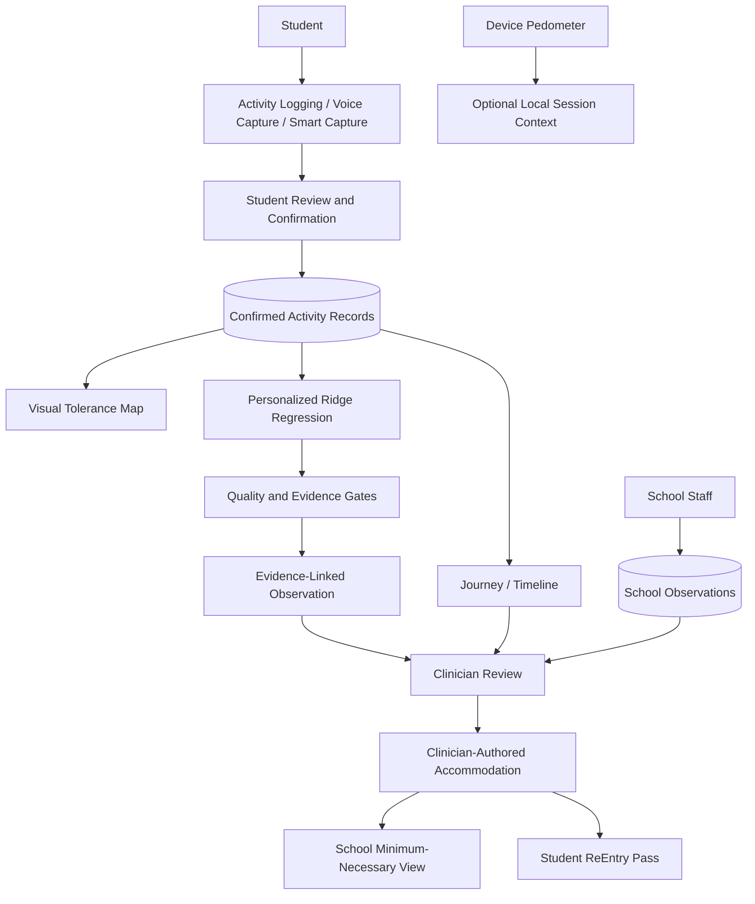

<p align="center">
  
</p>

# ReEntry

**Return to school. Return to friends. Return to life.**

ReEntry is an adolescent-first concussion recovery platform focused on return-to-school and return-to-life. It helps students capture real-world functional tolerance, turns confirmed records into evidence-linked longitudinal observations, and supports privacy-aware collaboration among students, School Staff, and Clinicians.

ReEntry supports recovery monitoring and communication. It does **not**:

- diagnose concussion or classify concussion severity;
- determine medical readiness;
- predict a recovery date;
- provide return-to-play clearance;
- prescribe treatment or automatically prescribe accommodations; or
- replace professional medical advice.

## The Problem

Concussion recovery happens between clinical visits. For adolescents, important functional experiences occur throughout classes, reading, screens, noisy or busy environments, concentration-heavy work, physical activity, social activity, and the broader school day. These experiences vary and can be difficult to remember or communicate later.

Clinicians need useful longitudinal evidence. Schools need actionable supports without receiving a student's entire private recovery record. Students need a low-friction way to explain what returning to school, friends, and everyday life actually feels like.

ReEntry addresses this observation and communication gap. It is not a generic symptom tracker, diary, or mood journal; its focus is functional tolerance during adolescent return to school and everyday life.

## Core Workflow

> Student experiences school → ReEntry captures functional tolerance → student confirms the record → personalized ML identifies sufficiently supported patterns → Clinician reviews supporting evidence → Clinician records an accommodation → School Staff receive minimum-necessary support information → student carries the ReEntry Pass

Actively linked School Staff can independently contribute structured **School Observations**. These remain a separate, provenance-labeled evidence stream. They are not silently merged into student activity records, Tolerance calculations, Journey student evidence, or personalized ML training data.

## Key Features

### Today / My Day

Fast student activity logging captures the activity and category, duration, student-reported manageability, challenge/context tags, an optional note, and recent activity context. Manageability is recorded as `Manageable`, `Some difficulty`, or `Very difficult`. These are student-reported functional observations, not medical conclusions.

### AI-Assisted Voice Capture

> Student speaks naturally → native/browser speech recognition → deterministic parser → structured activity draft → student reviews or edits → **Confirm & Log** → confirmed activity record

The parser can extract supported activity, duration, manageability, challenge tags, and text following an explicit note cue. Nothing saves automatically: student confirmation is mandatory. The full transcript is not automatically persisted as a note, raw audio is not retained by ReEntry, and speech is not medically interpreted. Typed fallback uses the same parser.

### School Schedule

Students can maintain a recurring, student-owned school schedule with class/activity names, categories, days, start/end times, active state, and reminder preference. Schedule context supports timely Smart Capture without becoming a medical interpretation of the school day.

### Smart Capture

After a scheduled class ends, Today can offer a low-friction opportunity to record how manageable it was. ReEntry can prefill already-known schedule context such as the activity, category, timing, and duration; the student still supplies or confirms the functional experience before saving through the normal activity-record path.

> We automate the collection opportunity, not the medical interpretation.

### Local Class Reminders

Optional, device-local reminders can be scheduled five minutes after enabled classes. They reduce retrospective logging burden without server-side monitoring. Tapping a valid reminder routes the student back to the relevant Today capture flow. Notification permission is requested only when reminders are enabled.

### Device Activity / Phone Context

ReEntry provides optional device activity context through `expo-sensors` and `Pedometer` on supported native devices:

- existing permission is checked without prompting;
- the student chooses **Allow** before ReEntry requests permission;
- **Not now** defers access for the session;
- the displayed step count is watched only while the relevant screen is active;
- no location is collected;
- no hidden or background monitoring is performed;
- no step history is persisted;
- steps are not attached to activity records;
- steps are not shared with School Staff or Clinicians;
- steps are not an ML input; and
- steps are not interpreted as concussion severity, medical safety, or readiness.

Unsupported devices and web show a graceful unavailable state. ReEntry does not claim full-day Android step tracking, screen-time tracking, heart-rate tracking, location tracking, or sensor-based concussion detection.

> ReEntry can automate contextual collection without automating medical interpretation.

### Observation Window

Today and Journey frame the student's actual loaded records within a longitudinal observation window: first recorded date, most recent date, represented days, and activity count. This makes the evidence under review clear. It does not imply that any number of days is a universal recovery timeline.

### Visual Tolerance Map

The interactive recent-record heatmap organizes functional evidence across Class / School, Screens, Reading, Noise / Busy, Concentration, Physical Activity, and Social Activity. Its four descriptive states are Manageable, Some difficulty, Very difficult, and No record.

Cells are derived from real supporting records. Tapping a cell reveals evidence for that dimension/date, while row interaction exposes recent evidence for the dimension. Minimum-data states are respected, no synthetic evidence is generated, and the map is descriptive—not a recovery score.

### Journey

Journey is the longitudinal recovery-story and evidence experience. It combines the observation window, chronological activity history, evidence-linked personalized observations, and supporting-record drill-down. Every surfaced ML-assisted pattern can be traced to confirmed records.

Journey does not show a recovery percentage, predicted recovery date, medical readiness, or claims of causation.

### Personalized ML Pattern Engine

ReEntry implements an actual personalized ridge-regression pattern engine in pure TypeScript. Its pipeline:

1. sorts the current student's confirmed activity records chronologically;
2. constructs deterministic features from activity-category one-hot values, challenge-tag presence, normalized duration, relative order in the observation window, and the immediately prior recorded manageability value;
3. fits a ridge-regularized model to that student's own records;
4. evaluates on a chronological final 25% holdout (at least three records);
5. compares mean absolute error with a training-mean baseline;
6. applies minimum-record, rating-variability, validation-quality, coefficient-strength, and evidence-support gates;
7. suppresses unsupported or unusable patterns; and
8. surfaces at most three eligible associations with supporting activity IDs.

The current gate requires at least 10 records and useful rating variation. Category, challenge-tag, and duration coefficients can become human-readable patterns only when the feature and direction have sufficient record support. Internal validation metrics remain model metadata rather than unexplained student-facing scores.

The model identifies associations in recorded functional experiences. It does not diagnose, establish causation, predict recovery, recommend treatment, determine readiness, or prescribe accommodations.

### Explainability and Evidence Provenance

> Pattern → evidence/support information → **Why am I seeing this?** → exact supporting records

Supporting activity IDs connect each surfaced observation to real records, giving students and Clinicians visibility into why it appeared. This is evidence provenance for an observational association, not proof of medical causation.

### School Observations

Actively linked School Staff can record structured observations:

- Completed as planned
- Completed with support
- Took a break
- Reduced or stopped

Records include school context, structured supports used, an optional note, and author/date provenance. They remain explicitly school-recorded, distinct from student self-report, reviewable by the Clinician, excluded from ML inputs, and unable to silently alter Tolerance or Journey student evidence.

### Clinician Workspace

The multi-student Clinician workspace presents actively linked students and distinct evidence sources: student-reported records, longitudinal context, evidence-linked ML observations with supporting-record drill-down, School Observations, and active accommodations. It also supports accommodation management.

AI surfaces observational evidence. The Clinician interprets it. The Clinician—not AI—records accommodations.

### School Staff Workspace

The multi-student School Staff workspace provides active/recorded school supports, structured School Observation tools, and minimum-necessary student information for actively linked students. It intentionally does not expose the student's entire private recovery record; that privacy boundary is part of the product design.

### Accommodations

Accommodations are Clinician-authored recorded school supports. ReEntry does not generate or automatically prescribe them. Once recorded, the same accommodation data becomes actionable in the Clinician workspace, minimum-necessary School view, and student ReEntry Pass.

### ReEntry Pass

The student-facing ReEntry Pass presents current recorded school supports in a practical, portable view. It is not medical clearance, a return-to-play decision, a readiness score, or proof of recovery.

### Need Support

The compact Need Support experience offers explicit paths to School support, Care team, a student-managed Trusted adult, and Emergency help.

The architecture supports multiple linked School Staff and Clinicians without rendering large individual cards. Explicitly shared support rows contain only display name, role, support phone, and support email. Active-link and matching-role RLS rules limit student access without broadening general `profiles` access. One contact acts directly; multiple contacts use a chooser rather than silently selecting someone. Call, Email, and applicable Text actions always require a student tap.

The repository contains `00007_student_trusted_contacts.sql` and `00008_shared_support_contacts.sql`, but these are currently pending/unapplied prototype migrations and require review and application before the corresponding persisted contacts are available in a deployed database.

Emergency help is explicit-action only. ReEntry performs no emergency detection and is not an emergency-response service.

> ReEntry does not monitor for emergencies or contact anyone automatically.

### Dark Mode and Low-Stimulation Mode

Dark Mode is an application-wide appearance option supported by ReEntry's light/dark brand assets and theme system. Low-Stimulation Mode is separate: it reduces decorative intensity, density, motion, and visual competition where supported while preserving essential information. This is an intentional adolescent/concussion-context UX choice, not symptom treatment.

## Responsible AI by Design

Safety is implemented throughout the workflow, not added only as a disclaimer:

- **Voice capture:** draft → student confirmation → persistence.
- **ML:** confirmed student data → personalized model → validation/evidence gates → supported observation.
- **Explainability:** surfaced pattern → supporting-record provenance.
- **Clinician:** AI does not make accommodation decisions.
- **School:** minimum-necessary disclosure rather than full private recovery records.
- **Pass:** recorded supports, not medical clearance.
- **Device activity:** optional local context, not medical interpretation.
- **Need Support:** explicit communication action only; no automatic contact or emergency detection.

ReEntry uses observational language such as “You reported…,” “Your records show…,” “This pattern appeared…,” and “Compared with your earlier entries….”

Prohibited outputs include diagnosis, severity classification, recovery percentage, recovery-date prediction, treatment recommendations, medication advice, return-to-play clearance, medical readiness, causation claims, and automated accommodation prescriptions.

## Privacy-Aware Role Design

| Role | Access |
| --- | --- |
| Student | Own private activity/check-in records, schedule, Tolerance Map, Journey, accommodations, ReEntry Pass, trusted-support configuration, and other student-owned preferences/data |
| Clinician | Relevant evidence for actively linked students, School Observations, and the accommodation workflow permitted by RLS |
| School Staff | Minimum-necessary recorded school supports and the School Observation workflow for actively linked students |

Supabase Auth identifies users; PostgreSQL Row Level Security combines role checks with active `student_access` relationships. This supports data minimization at the database boundary rather than relying only on hidden UI. Pending `shared_support_contacts` infrastructure is intentionally separate from general/private profile data and is limited to support information explicitly shared with linked students.

ReEntry does not claim HIPAA compliance or regulatory certification.

## Technical Architecture

**Frontend**

- Expo and React Native
- Expo Router
- React Native Web
- TypeScript

**Backend**

- Supabase and PostgreSQL
- Supabase Auth
- Row Level Security
- Supabase `sign-up` Edge Function

**Native capabilities**

- `expo-speech-recognition`
- `expo-notifications`
- `expo-sensors` / `Pedometer`

**ML**

- Personalized local ridge-regression pattern engine

The project supports web and native mobile development. Native speech recognition, local notifications, and pedometer behavior require an appropriate native/development build and compatible platform permissions/hardware; they cannot be fully represented by Expo Go or web.

## Architecture Diagram



School Observations flow to Clinician review but never into the personalized ML engine. Device steps remain a separate local context path and are neither persisted nor clinically interpreted.

## Data Model

Important PostgreSQL tables in the migration history include:

- `profiles`
- `user_preferences`
- `activity_logs`
- `challenge_tags`
- `daily_checkins`
- `accommodation_records`
- `student_access`
- `student_schedule_items`
- `school_observations`
- `student_trusted_contacts` *(pending migration `00007`)*
- `shared_support_contacts` *(pending migration `00008`)*

The pending label reflects the current local repository state; it is not a claim that those migrations have been applied to a deployed database.

## Evidence-Informed Design

ReEntry's design is informed by themes in:

- Consensus statement on concussion in sport: the 6th International Conference on Concussion in Sport
- Living Concussion Guidelines
- PedsConcussion Living Guideline for Pediatric Concussion

Themes such as return to school, gradual return to activity as tolerated, temporary school supports, ongoing monitoring and modification, and collaboration among students, caregivers, school personnel, and healthcare professionals inform concrete product decisions: functional activity capture, a longitudinal observation window, recorded accommodations, role-specific collaboration, and human clinical interpretation.

This is design context—not endorsement, clinical validation, or a claim that ReEntry itself is medical guidance.

## Why ReEntry Is Different

> real-world adolescent experiences + low-friction confirmed capture + schedule/context-aware collection + functional tolerance visualization + personalized evidence-linked ML + structured School Observations + Clinician interpretation + accommodations + minimum-necessary School communication + ReEntry Pass

ReEntry connects that full return-to-school evidence loop. The core idea is not simply tracking concussion symptoms; it is translating everyday functional experiences into understandable, traceable, role-appropriate information that can support return-to-school communication.

## Accessibility and Adolescent UX

Intentional design choices include adolescent-first workflows, fast activity logging, voice-assisted capture with less long-form typing, comfortable touch targets, Dark Mode, Low-Stimulation Mode, a visual Tolerance Map, consistent role-specific navigation, restrained visual hierarchy, and evidence drill-down instead of unexplained AI conclusions.

No WCAG or formal accessibility certification is claimed.

## Demo Story

All demo people and records are synthetic.

1. Maya, age 16, moves through her school day.
2. Her recurring schedule provides class context.
3. Smart Capture or Voice Capture reduces logging friction.
4. Maya reviews and confirms her activity record.
5. Confirmed records contribute to Tolerance and Journey.
6. With sufficient usable evidence, the personalized model may surface an evidence-linked observation.
7. Maya or the Clinician can inspect its supporting records.
8. School Staff can contribute a separate structured School Observation.
9. The Clinician reviews the distinct evidence streams.
10. The Clinician records an accommodation.
11. School Staff receive the relevant minimum-necessary support.
12. Maya can carry or show the ReEntry Pass.
13. Need Support provides an explicit path to human support when needed.

Additional synthetic students demonstrate multi-student School and Clinician workspaces. No demo passwords are published here.

## Real-World Feasibility

ReEntry uses ordinary smartphones, student-confirmed observations, optional local device context, local reminders, role-based collaboration, and Clinician-authored accommodations. It does not depend on continuous surveillance, specialized medical hardware, automatic concussion detection, continuous Clinician monitoring, or giving School Staff the student's full private record.

This practical architecture does not imply deployment readiness beyond the current prototype.

## Local Development

### Requirements

- Node.js
- pnpm 11
- A Supabase project configured for this application
- An appropriate native/development build for native capabilities

### Environment

Create a local `.env` containing the public client configuration:

```bash
EXPO_PUBLIC_SUPABASE_URL=your-project-url
EXPO_PUBLIC_SUPABASE_ANON_KEY=your-anon-key
```

Never expose a `SUPABASE_SERVICE_ROLE_KEY` to client code or commit it to source control.

### Run

```bash
pnpm install
pnpm web
```

Other supported development commands:

```bash
pnpm start
pnpm android
pnpm ios
```

Speech recognition, notifications, and pedometer/device activity require a compatible native/development build; do not rely on Expo Go or web to represent those native features fully.

## Prototype Status and Limitations

ReEntry is a Hack for Humanity prototype. It is not clinically validated, a diagnostic system, or an approved medical device. It makes no claims of diagnostic accuracy, regulatory certification, or HIPAA compliance. The personalized ML workflow is currently demonstrated with prototype and synthetic demo data where applicable.

Step availability depends on native platform, hardware, and permission support. Further clinical evaluation, privacy/security review, accessibility testing, and real-user testing would be required before real-world clinical deployment.

ReEntry's practical differentiator remains focused: translating real-world adolescent functional tolerance into evidence-linked, privacy-aware collaboration across student, School Staff, and Clinician.
